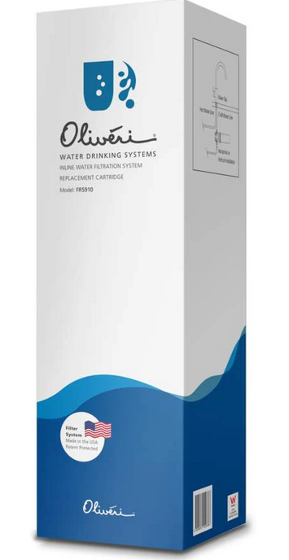

# Kitchen sink

* change water filter once a year
* if more water quality drops or tastes funny, this is a sign to change the cartridge earlier
* replace drip tray once or twice a year
* if flame is reduced or not hot enough, burners need cleaning (use a pipe cleaner). If this fails to resolve the issue, purchase new burners

## Sink filter cartridge
* Feb 2022
* Jan 2023
* due end of 2023

## Item to purchase

* order in advance from https://getstuff.com.au/products/oliveri-replacement-cartridge-for-fs5010-fr5910?_pos=1&_sid=b98746ac8&_ss=r

## Steps to change cartridge
1. shut water valve to stop water flow
2. remove all items from underneath sink to move around freely
3. place towel underneath existing cartridge
4. twist and pull down to remove old cartridge (spillage may occur)
5. twist and push up to install new cartridge (wait for the click and to fit in)
6. open water valve to allow water flow
7. turn on tap for a few minutes to feed water through new cartridge. At this point, water will spit out and look grey. This is normal (for now)
8. after a few minutes, if water colour + taste looks normal, we're all done